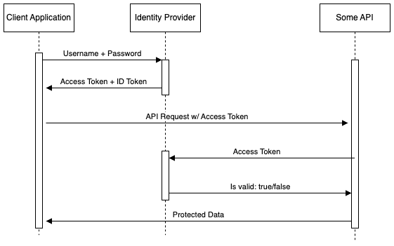

Just here for the code? Click [here](#the-code)

# User Authentication

## How it works
Like many things in technology, a real life example is often the best way of explaining more complicated topics. When it comes to web-based user authentication, I like to think of the analogy of a painter doing work at your house. Often this person is given a spare key or is told of a door that will remained unlocked so that they can some in and do work on the house even if the owner is not home. Upon entering the house using the key, you know that they've entered the correct house, and some basic characteristics about them, such as their name, seem correct as well. However, before you let them paint the walls of your home, you want to verify their identity through a driver's license and a business card. The painter hands you the documents. You can trust the information given on the driver's license since it comes from a reliable source(the government), and you can be confident in their ability to paint your home because their business card comes from a painting company, so you ultimately let them in to paint your house.

Modern user authentication uses the [OAuth 2.0](https://oauth.net/2) protocol which maps to this analogy quite nicely:
<br />&nbsp;&nbsp;&nbsp;&nbsp;&nbsp;&nbsp;1. Correct key in order to enter house -> Log in to application using username and password  <br />
&nbsp;&nbsp;&nbsp;&nbsp;&nbsp;&nbsp;2. Validate painter's identity and proof of occupation -> Authorization of user and their permissions upon request for data<br /><br />


#### Authentication
The flow starts with the user typing in their credentials into the **client** application(the key unlocking the door to the house). These credentials are then send to an **identity provider** for verification. Here are some popular modern identity providers:
<br />
&nbsp;&nbsp;&nbsp;&nbsp;&nbsp;&nbsp;1. [KeyCloak](https://www.keycloak.org) <br />
&nbsp;&nbsp;&nbsp;&nbsp;&nbsp;&nbsp;2. [Okta](https://www.okta.com) <br />
&nbsp;&nbsp;&nbsp;&nbsp;&nbsp;&nbsp;2. [Frontegg](https://frontegg.com) <br />
Upon successful login, the authorization server response back with an access token and ID token. These tokens are in [JWT](https://jwt.io/introduction) format so we can be sure they can't be tampered with.
#### Authorization
Now that the user's credentials have been correctly, you need to ensure that the user making requests for data is who they say they are _and_ have the correct permissions to do so. To do this you need to ask the identity provider to validate the access token. If valid, the access token, which contains the user's custom permissions, can then be used to verify that they are indeed allowed to perform the action they're requesting to do. If they are, the request continues on and the user is shown the appropriate data.
```
Error messages:
401(unauthorized) = need to authenticate or login failed
403(forbidden) = insufficient permissions to perform requested action
```

## The code
Hopefully the above introduction laid out three distinct parts of a successful authentication flow<br />
&nbsp;&nbsp;&nbsp;&nbsp;&nbsp;&nbsp;1. The identity provide <br />
&nbsp;&nbsp;&nbsp;&nbsp;&nbsp;&nbsp;2. The client application <br />
&nbsp;&nbsp;&nbsp;&nbsp;&nbsp;&nbsp;2. The back-end API 
<br />

#### Identity provider
From a developer's standpoint the only things you need to know about in terms of the identity provider are as follows
<br />
&nbsp;&nbsp;&nbsp;&nbsp;&nbsp;&nbsp;1. Authorization URL <br />
&nbsp;&nbsp;&nbsp;&nbsp;&nbsp;&nbsp;2. Client ID <br />
&nbsp;&nbsp;&nbsp;&nbsp;&nbsp;&nbsp;3. Client secret <br />
This information can be obtained through your identity provider's admin portal.

#### Client application
The are _many_ front-end libraries that provide easy to use OAuth setup but we'll be focusing on [Auth0t](https://www.npmjs.com/package/@auth0/auth0-react) as it's a very popular and flexible library for authenticating against almost any OIDC service. 
##### 1. Setting up client application
```jsx
//index.jsx
import React from 'react';
import { createRoot } from 'react-dom/client';
import { Auth0Provider } from '@auth0/auth0-react';
import App from './App';
const root = createRoot(document.getElementById('app'));

root.render(
  <Auth0Provider
    domain="AUTH0_DOMAIN"
    clientId="AUTH0_CLIENT_ID"
    authorizationParams={{
      redirect_uri: window.location.origin
    }}
  >
    <App />
  </Auth0Provider>
);
```
This code ensures all of the pages within your application have what they need to properly authenticate the user.
Within your App.js file, you should have the following
```jsx
//App.jsx
import React from 'react';
import { useAuth0 } from '@auth0/auth0-react';

function App() {
  const { isLoading, isAuthenticated, error, user, loginWithRedirect, logout } = useAuth0();

  if (isLoading) {
    return <div>Loading...</div>;
  }
  if (error) {
    return <div>Oops... {error.message}</div>;
  }

  if (isAuthenticated) {
    return (
      <div>
        Welcome, you are authenticated
      </div>
    );
  } else {
    return loginWithRedirect();
  }
};

export default App;
```
The beauty of the auth0 library is that state management is easy to access and done for you. In this particular example the error, loading, and is authenticated states are all kept track of for you which makes for simple conditional rendering depending on the user's current auth state. 

For logout, the following function from the same @auth0/auth0-react can be used
```js
logout({ logoutParams: { returnTo: window.location.origin }})
```

##### 2. Back-end authentication


